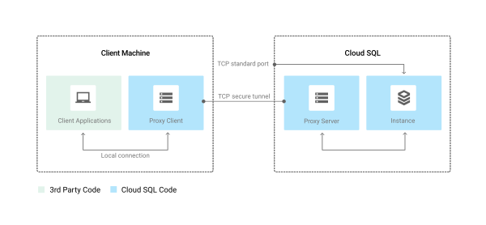

# Cloud SQL with Terraform

## Overview
In this hands-on lab you will learn to create Cloud SQL instances with Terraform, then set up the Cloud SQL Proxy, testing the connection with MySQL client.

## Objectives
* Create a Cloud SQL instance
* Install the Cloud SQL Proxy
* Test connectivity with MySQL client using Cloud Shell

## Training environment


Clone the tutorial repository

```bash
git clone https://github.com/.../....git
```


If you are using a local environment instad of a cloud shell, define your project variable.

```bash
export GOOGLE_PROJECT=$(gcloud config get-value project)
```

## Cloud SQL

Verifying the Terraform version. 

Check the terraform version:

```bash
terraform version
```

Example Output:
```
Terraform v0.12.2
```

### Understand the code

Take a look at the contents of main.tf file:

```bash
cat main.tf
```

Example Output (truncated for readablilty):

```
...
resource "google_sql_database_instance" "master" {
  name                 = var.name
  project              = var.project
  region               = var.region
  database_version     = var.database_version
  master_instance_name = var.master_instance_name

  settings {
    tier                        = var.tier
    activation_policy           = var.activation_policy
    authorized_gae_applications = var.authorized_gae_applications
    disk_autoresize             = var.disk_autoresize
    dynamic "backup_configuration" {
      ...
    }
    dynamic "ip_configuration" {
      ...
    }
    dynamic "location_preference" {
      ...
    }
    dynamic "maintenance_window" {
      ...
    }
    disk_size        = var.disk_size
    disk_type        = var.disk_type
    pricing_plan     = var.pricing_plan
    replication_type = var.replication_type
    availability_type = var.availability_type
  }

  dynamic "replica_configuration" {
    ...
  }

  timeouts {
    create = "60m"
    delete = "2h"
  }
}
...
```

You can specify the cloudsql instance name in configuration or while deploying the terraform script.


### Run Terraform
The terraform init command is used to initialize a working directory containing Terraform configuration files.

This command performs several different initialization steps in order to prepare a working directory for use. This command is always safe to run multiple times, to bring the working directory up to date with changes in the configuration.

```bash
terraform init
```
The `terraform plan` command is an optional but recommended command and is used to create an execution plan. Terraform performs a refresh, unless explicitly disabled, and then determines what actions are necessary to achieve the desired state specified in the configuration files.

This command is a convenient way to check whether the execution plan for a set of changes matches your expectations without making any changes to real resources or to the state. For example, terraform plan might be run before committing a change to version control, to create confidence that it will behave as expected.

```bash
terraform plan -out=tfplan
```

If you didn't specify the cloud instance name in configturation, this message will be prompted. Please specify a cloudsql instance name.
```
var.name
  Name for the database instance. Must be unique and cannot be reused for up to one week.

  Enter a value:
```

Example Output (truncated for readability):
```
...
Plan: 4 to add, 0 to change, 0 to destroy.

------------------------------------------------------------------------

This plan was saved to: tfplan

To perform exactly these actions, run the following command to apply:
    terraform apply "tfplan"

```

The optional `-out` argument can be used to save the generated plan to a file for later execution with `terraform apply`.

The `terraform apply` command is used to apply the changes required to reach the desired state of the configuration or the pre-determined set of actions generated by a `terraform plan` execution plan.

```bash
terraform apply tfplan
```

This will take a little while to complete.


## Cloud SQL Proxy

The Cloud SQL Proxy provides secure access to your Cloud SQL Second Generation instances without having to whitelist IP addresses or configure SSL.

Accessing your Cloud SQL instance using the Cloud SQL Proxy offers these advantages:

* **Secure connections:** The proxy automatically encrypts traffic to and from the database using TLS 1.2 with a 128-bit AES cipher; SSL certificates are used to verify client and server identities.
* **Easier connection management:** The proxy handles authentication with Cloud SQL, removing the need to provide static IP addresses.


#### How the Cloud SQL Proxy works

The Cloud SQL Proxy works by having a local client, called the proxy, running in the local environment. Your application communicates with the proxy with the standard protocol used by your database. The proxy uses a secure tunnel to communicate with its companion process running on the server.

The following diagram shows how the proxy connects to Cloud SQL:




### Installing the Cloud SQL Proxy

Download the proxy

```bash
wget https://dl.google.com/cloudsql/cloud_sql_proxy.linux.amd64 -O cloud_sql_proxy
```

Make the proxy executable:
```bash
chmod +x cloud_sql_proxy
```

You can install the proxy anywhere in your environment. The location of the proxy binaries does not impact where it listens for data from your application.

#### Proxy startup options
When you start the proxy, you provide it with the following sets of information:

* What Cloud SQL instances it should establish connections to
* Where it will listen for data coming from your application to be sent to Cloud SQL
* Where it will find the credentials it will use to authenticate your application to Cloud SQL

The proxy startup options you provide determine whether it will listen on a TCP port or on a Unix socket. If it is listening on a Unix socket, it creates the socket at the location you choose; usually, the /cloudsql/ directory. For TCP, the proxy listens on localhost by default.


### Test connection to the database

Start by running the Cloud SQL proxy for Cloud SQL instance

```bash
MYSQL_DB_NAME=$(terraform output -json | jq -r '.instance_name.value')
MYSQL_CONN_NAME="${GOOGLE_PROJECT}:us-central1:${MYSQL_DB_NAME}"
```

```bash
./cloud_sql_proxy -instances=${MYSQL_CONN_NAME}=tcp:3306
```

Start another Terminal or Cloud Shell tab by clicking on plus (+) icon. You'll use this shell to connect to the Cloud SQL proxy.

Navigate to project directory `terraform-gcp-cloud-sql` if you are not in it.

Generate password for MySQL

```bash
echo MYSQL_PASSWORD=$(terraform output -json | jq -r '.generated_user_password.value')
```

Test the MySQL connection:
```bash
mysql -udefault -p --host 127.0.0.1 default
```

When prompted, enter the value of MYSQL_PASSWORD, found in the output above, and press *Enter*.

You should successfully log into the MYSQL command line. Exit from MYSQL by typing *Ctrl + d*.

If you go back to the first Cloud Shell tab you'll see logs for the connections made to the Cloud SQL Proxy.


## References:

- https://www.qwiklabs.com/focuses/1215?parent=catalog